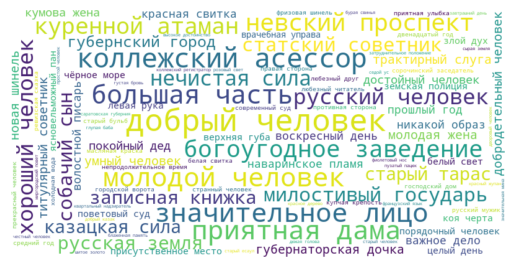

# Bigram Wordclouds: Russian Classics

This coding project focuses on extracting and analyzing word bigrams from a corpus of Russian classic literature. The selected corpus includes prose works by renowned authors such as Blok, Pasternak, Pushkin, Turgenev, Gogol, Gorky, Dostoevsky, Tolstoy, and Chekhov. The objective is to identify distinctive adjective-noun pairs (bigrams) for each author and visualize them through wordclouds.

## Data Collection
I obtained the dataset for this project from Kaggle: https://www.kaggle.com/datasets/d0rj3228/russian-literature \
The corpus comprises the prose works of the following Russian classic authors:

- Blok 
- Pasternak 
- Pushkin
- Turgenev
- Gogol
- Gorky
- Dostoevsky
- Tolstoy
- Chekhov

The corpus size is 5,039,011 words.

## Morphological Analysis
The Natural Language Toolkit (nltk) library is employed for morphological analysis. Specifically, the code extracts word bigrams, focusing on combinations of adjectives and nouns from the literature corpus.

## TF-IDF Calculation
TF-IDF (Term Frequency-Inverse Document Frequency) is calculated for each bigram in the corpus. This metric helps identify the importance of a bigram within the context of a specific author's body of work.

## Unique Bigrams Identification
The bigrams with the highest TF-IDF scores for each author are considered the most unique to that author.

## Wordcloud Creation
The wordcloud library is utilized to create visual representations of the most unique bigrams for each author. These wordclouds offer an intuitive and engaging way to observe the distinctive language patterns associated with each writer.

